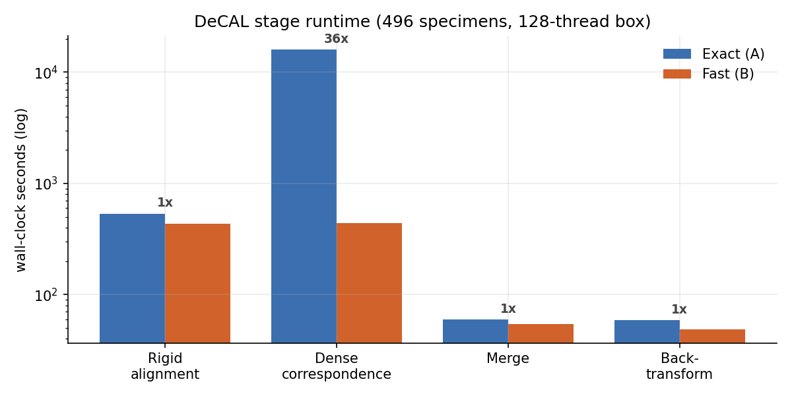
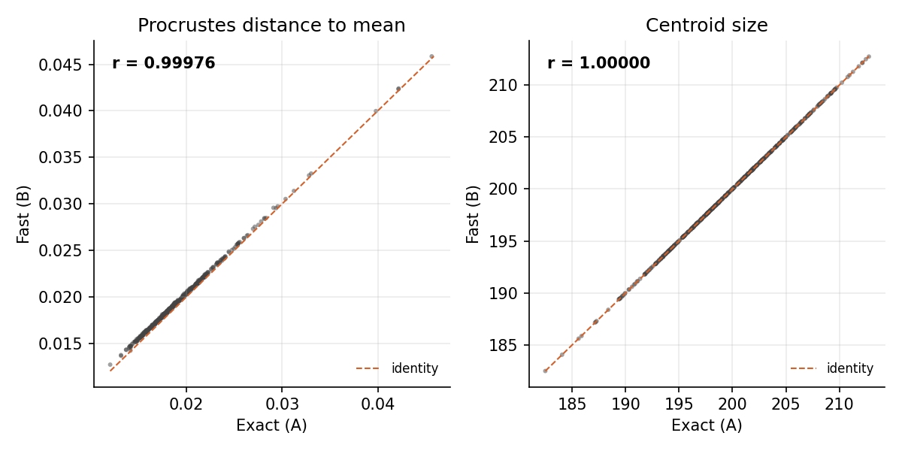
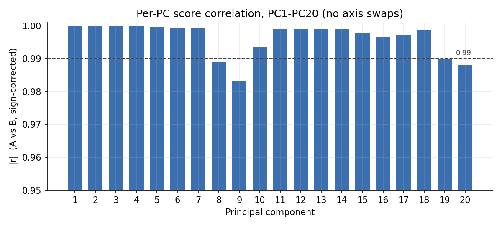
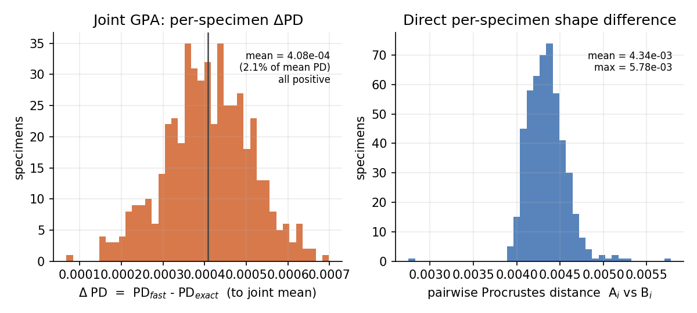

# Evaluating a fast approximate dense-correspondence option for DeCAL

**Summary.** DeCAL (the dense semi-landmarking workflow in the SlicerMorph *DenseCorrespondenceAnalysis* extension) establishes point correspondences by projecting a template's points onto each specimen's surface. The canonical method finds, for every template point, the **closest point on the target surface** (`vtkCellLocator`); this dominates runtime on large datasets. We added an **opt-in "fast" method** that instead finds the **nearest target vertex** using a vectorized k-d tree (`scipy.spatial.cKDTree`). On a 496-specimen craniofacial dataset (1057 landmarks each), the fast method reduced the dense-correspondence stage from **4.4 hours to 7.3 minutes (~36×)** while leaving downstream shape analysis effectively unchanged: Procrustes distance and centroid size correlate with the exact method at r = 0.9998 and r > 0.9999, and all of PC1–PC20 correlate at |r| ≥ 0.98 with no axis reordering. The only systematic effect is a uniform **~2% inflation of Procrustes distances** (≈4% in absolute Procrustes variance), the expected signature of small isotropic vertex-snap noise. The fast method is **off by default**; the exact method remains the canonical/published path.

---

## 1. Background: two ways to assign correspondences

For each specimen, DeCAL warps a template to the specimen (thin-plate spline over the fixed landmarks) and then assigns every template point a location on that specimen. Both methods answer the same question — *where does this template point land on the specimen?* — but define "closest" differently. Throughout, **A** denotes the exact method (the reference and current default) and **B** the fast method.

**Exact (A, DeCAL's canonical method) — closest point on the surface.** For each template point, find the nearest point anywhere on the specimen **surface**: on a triangle's face, edge, or vertex. This is a point-to-*mesh* query, performed by `vtkCellLocator`, which builds a spatial index over the mesh's triangles and returns the true closest point on the nearest triangle. It is exact but expensive — each query tests triangle geometry, and the queries run one at a time in a Python loop over ~10⁵ template points × ~500 specimens, which is what dominates DeCAL's runtime.

**Fast (B, opt-in) — nearest vertex.** Ignore the triangles: build a **k-d tree over the specimen's vertices** (`scipy.spatial.cKDTree`) and, for each template point, return the single nearest **vertex**. This is a point-to-*point-cloud* query. It is much faster for two reasons — a k-d tree nearest-neighbour lookup is O(log N), and, crucially, the entire set of lookups is one vectorized, multithreaded C call rather than a per-point Python loop.

The trade-off is exactness for speed: because the fast method can only land on an existing vertex, its answer can differ from the true closest surface point by up to roughly half the local edge length. On the dense meshes DeCAL produces (~10⁵ vertices, small triangles) that gap is small — exactly what the shape-agreement results below quantify. Because it is a real (if small) numerical change, we evaluated (i) the speed-up and (ii) whether it moves the morphometric result before offering the fast method as an option.

## 2. Data and methods

**Data.** 496 specimens; each DeCAL output is a merged landmark set of **1057 points = 55 fixed anatomical landmarks + 1002 dense semi-landmarks**, written in the original (un-aligned) specimen coordinate frame (`mergedLMs_originalFrame`). A and B are the **same specimens through the same DeCAL pipeline and the same atlas**, differing only in the correspondence method. Point *j* corresponds across all specimens and between A and B by construction; the 55 fixed points are identical between A and B, so all differences live in the 1002 semi-landmarks.

**Shape analysis.** Generalized Procrustes Analysis (full GPA, with scaling; **no semilandmark sliding**, so the comparison reflects the raw correspondence output), implemented in NumPy and applied **identically** to A and B. From each GPA we take: **centroid size (CS)** (from the original-frame configuration), **Procrustes distance to the mean (PD)** per specimen, and **PC scores** (PCA of the aligned coordinates). Two analyses:

1. **Separate GPAs** (A alone, B alone), then correlate the corresponding per-specimen metrics across the 496 specimens: PD, CS, and PC1–PC20 (diagonal, sign-corrected because PCA axis signs are arbitrary; we also check the full 20×20 cross-correlation for axis swaps).
2. **Joint GPA** (all 992 configurations in one superimposition); per specimen, Δ = PD(fast) − PD(exact), each measured to the joint mean. We also report the direct per-specimen pairwise Procrustes distance between A and B.

**Environment.** 3D Slicer 5.12.1 (SlicerMorph / DeCA extension). Machine: AMD Ryzen Threadripper PRO 3995WX (64 cores / 128 threads), 504 GB RAM, Ubuntu 24.04.4 LTS (kernel 6.8.0), x86-64. GPA/statistics: Python 3.12, NumPy 2.4.4, SciPy 1.17.1. Runtimes are wall-clock from the two production runs (files are written incrementally, so each stage's file-timestamp span is its wall-clock; the exact run's per-specimen intervals were uniform at ~32 s, confirming continuous compute).

## 3. Results

### 3.1 Runtime (Table 1, Fig. 4)

The fast method affects only the dense-correspondence stage; alignment, merging, and back-transform are unchanged.

**Table 1. DeCAL stage runtime, 496 specimens.**

| Stage | Exact (A) | Fast (B) | Speed-up |
|---|---:|---:|---:|
| Rigid alignment | 536 s | 433 s | ~1× |
| **Dense correspondence** | **15,983 s (4.44 h)** | **440 s (7.3 min)** | **36.3×** |
| Merge fixed+semi | 60 s | 54 s | ~1× |
| Back-transform to original frame | 59 s | 49 s | ~1× |
| **Total DeCAL compute** | **≈4.6 h** | **≈16 min** | **~17×** |

Per specimen, dense correspondence was **32.3 s (exact)** vs **0.89 s (fast)**. Because the fast query is multithreaded (`cKDTree`, `workers=-1`) while the exact loop is single-threaded, most of the gain comes from parallelizing the query and the speed-up scales with core count: **36× on this 128-thread machine, but only roughly 5–6× on a typical laptop (~8–10 cores)**. Even single-threaded, the vectorized query still removes the dominant Python-loop overhead.

### 3.2 Shape agreement (Table 2, Figs. 1–2)

**Table 2. Agreement between exact (A) and fast (B), across 496 specimens.**

| Metric | Result |
|---|---|
| Procrustes distance to mean, r(PD_A, PD_B) | **0.99976** |
| Centroid size, r(CS_A, CS_B) | **0.999996** |
| PC1–PC20 score correlations (diagonal, \|r\|) | **all ≥ 0.983; 14/20 ≥ 0.999** |
| Lowest three PCs | PC9 = 0.983, PC20 = 0.988, PC8 = 0.989 |
| PC axis swaps through PC20 | **none** (each A PCk best-matches B PCk) |

Size, per-specimen shape extremity, and the full ordination structure are reproduced. Per-PC variance-explained matches, with B a consistent ~0.3–0.5% lower in the leading PCs — the extra vertex-snap variance spreads into higher components.

### 3.3 The one systematic effect (Fig. 3)

In the joint GPA, Δ = PD(fast) − PD(exact) is **positive for every specimen** (mean 4.08×10⁻⁴, sd 1.0×10⁻⁴), i.e. **2.1% of the mean Procrustes distance (1.91×10⁻²)**. The fast method uniformly nudges each specimen slightly farther from the consensus. The direct per-specimen difference (pairwise Procrustes distance A↔B) averages 4.34×10⁻³ (max 5.78×10⁻³) but is **nearly isotropic** — only ~2% projects onto the radial (toward/away-from-mean) direction. In other words, vertex-snapping adds small near-random perturbations to the semi-landmarks with a tiny consistent outward bias, rather than a directional distortion.

## 4. Discussion and recommendation

For **relative / comparative** morphometrics — ordination, group differences, allometry, integration/modularity, regression, PC structure — the fast method is **effectively interchangeable** with the exact method (correlations ≈ 1, no axis reordering through PC20). The only caveat is for **absolute** dispersion statistics: because PD is inflated ~2%, absolute Procrustes variance / morphological disparity read ~4% higher under the fast method — uniformly, so relative comparisons still hold.

**Recommendation.** Use the fast method freely for exploration, method development, and large-N pipelines where the ~36× speed-up matters. For a study that reports **absolute** disparity magnitudes, either use the exact method or note the ~2–4% systematic inflation. The fast method is shipped **off by default** (an opt-in "Compute fast correspondences" checkbox on the DeCAL tab); the DeCA tab and the atlas/template build always use the exact method, and with the box unchecked the output is bit-identical to the canonical implementation.

**If you want to use the fast method but are concerned about variance inflation,** the residual effect is easy to correct with a small calibration sample — because it is not a directional distortion but ordinary measurement error. The fast-vs-exact difference is 99.7% isotropic (the mean per-landmark shift vector carries only 0.3% of it), so there is no shared shape-space direction to subtract off. Instead the fast method adds isotropic noise whose *variance* is systematic: PD²(fast) ≈ PD²(exact) + σ², with σ² ≈ 1.9×10⁻⁵ here. Correct it the standard way:

1. Run **both** methods on ~15–25 calibration specimens spanning the size range (the exact runs are the only extra cost).
2. Estimate σ̂² as the mean, over those specimens, of the squared Procrustes distance between the exact and fast version of the *same* specimen.
3. On the full fast-only dataset, subtract σ̂² from the Procrustes variance / disparity (and 2σ̂² from squared **pairwise** distances, e.g. for distance-based clustering); for per-specimen distances use PD_corr = √(max(PD²_fast − σ̂², 0)).

Estimating σ̂² from as few as 15 specimens (it averages over ~1000 landmark differences each, so it is tight) recovered the exact-method result:

| | fast, uncorrected | after σ̂² subtraction |
|---|---:|---:|
| Absolute disparity, error vs exact | +4.0% | −0.8% |
| Per-specimen PD, RMS error vs exact | 2.4% | 0.6% |

Relative analyses — ordination, group differences, allometry, regression — need no correction, since isotropic noise does not bias directions. This is simply the standard measurement-error / repeatability treatment used throughout geometric morphometrics.

## 5. Reproducibility

- **Software:** `SlicerMorph/SlicerDenseCorrespondenceAnalysis` (DeCA extension); fast method = `scipy.spatial.cKDTree` nearest-vertex, exact = `vtkCellLocator` closest-point-on-surface.
- **This analysis:** self-contained NumPy GPA + metrics; inputs are the two `mergedLMs_originalFrame` folders; outputs (`analysis1_per_specimen.csv`, `analysis1_pc_correlations.csv`, `analysis2_joint_deltas.csv`) and figures are provided so the tables/plots can be regenerated.
- **Conventions:** full GPA with scaling, no semilandmark sliding, all 1057 points; PD = partial Procrustes distance to the GPA mean; CS from original-frame configurations; PC correlations sign-corrected.

*Runtimes are from production runs on the machine above; the ~36× is hardware-dependent (multithreaded fast query vs single-threaded exact loop). Shape-agreement results are hardware-independent.*
